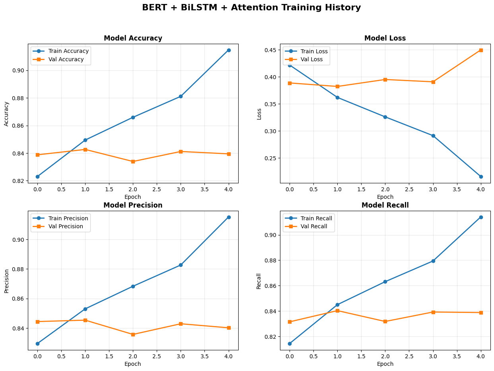
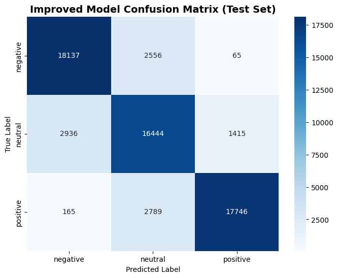

# Yelp Reviews Sentiment Analysis

**Autor:** Diego Antonio García Padilla

**Matrícula:** A01710777

## 1 Dataset

El dataset utilizado es el **[Yelp Academic Dataset](https://www.kaggle.com/datasets/yelp-dataset/yelp-dataset)**, que contiene aproximadamente 7 millones de reseñas de negocios de la plataforma Yelp. Este dataset es ampliamente reconocido en la comunidad académica y ofrece:

- **Escala:** Suficientes datos para entrenar modelos complejos de deep learning
- **Diversidad:** Reviews de múltiples categorías de negocios y ubicaciones geográficas
- **Autenticidad:** Feedback real de usuarios con sus respectivas calificaciones
- **Riqueza lingüística:** Variedad en longitud, estilo y expresividad del texto

## 2 Preparación del entorno

El proyecto fue desarrollado originalmente en **Google Colab**, utilizando:

- Gemini integrado para la documentación
- Google Drive para persistencia de datos

**Ejecución Local (Opcional):**

Para ejecutar el proyecto en un ambiente local:

1. Crear entorno virtual

```bash
python -m venv venv
```

2. Activar entorno virtual

 - Linux/Mac
   
```bash
source venv/bin/activate
```

 - Windows

```bash
venv\Scripts\activate
```

3. Instalar dependencias

```bash
pip install -r requirements.txt
```

4. Remover celdas específicas de Colab

```python
from google.colab import drive
drive.mount('/content/drive')
```

## 3 ETL (Extract, Transform, Load)

El proceso ETL se documentó en el notebook `PortfolioETL.ipynb` y consistió en tres fases principales.

### 3.1 Extracción

La extracción del dataset se realizó mediante la librería `kagglehub`, que descarga automáticamente los archivos del Yelp Academic Dataset desde Kaggle:

```python
import kagglehub

# Download Yelp dataset

yelp_path = kagglehub.dataset_download("yelp-dataset/yelp-dataset")
print(f"Dataset downloaded to: {yelp_path}")
```

**Archivos obtenidos:**

- `yelp_academic_dataset_review.json` (5.09 GB) - **Archivo principal utilizado**
- `yelp_academic_dataset_business.json` (113 MB)
- `yelp_academic_dataset_user.json` (3.2 GB)
- `yelp_academic_dataset_checkin.json` (274 MB)
- `yelp_academic_dataset_tip.json` (172 MB)

Para este proyecto, únicamente se requirió el archivo de reviews, que contiene el texto y las calificaciones necesarias para el análisis de sentimientos.

### 3.2 Transformación

La transformación del dataset involucró seis pasos secuenciales de preprocesamiento:

#### **Paso 1: Selección de features**

Para optimizar el uso de memoria y enfocarse en las variables relevantes, se extrajeron únicamente dos columnas del dataset original: **text** y **stars**.

```python
def select_features(self, df: pd.DataFrame, features: list) -> pd.DataFrame:
  return df[features].copy()


df = self.select_features(df, ["text", "stars"])
```

#### **Paso 2: Eliminación de duplicados**

Los duplicados pueden introducir sesgo al modelo, haciendo que memorice reviews repetidas en lugar de aprender patrones generalizables. Su eliminación asegura que cada ejemplo de entrenamiento sea único.

```python
def drop_duplicates(self, df):
  return df.drop_duplicates()
```

#### **Paso 3: Creación de feature de sentimiento**

Dado que el dataset original utiliza calificaciones de 1-5 estrellas, se creó una variable categórica `sentiment` que agrupa las estrellas en tres clases:

```python
def create_sentiment_column(self, df: pd.DataFrame) -> pd.DataFrame:
    def _classify(stars):
      if stars in (1.0, 2.0): return "negative"
      if stars == 3.0:        return "neutral"
      if stars in (4.0, 5.0): return "positive"
      return None

    df = df.copy()
    df["sentiment"] = df["stars"].apply(_classify)

    return df[["text", "sentiment"]]
```

**Mapeo:**

- **Negativo:** 1-2 estrellas (experiencias insatisfactorias)
- **Neutral:** 3 estrellas (experiencias medianas o mixtas)
- **Positivo:** 4-5 estrellas (experiencias satisfactorias)

Este agrupamiento es estándar en análisis de sentimientos y refleja cómo los consumidores interpretan las calificaciones en la práctica. Una calificación de 3/5 raramente se considera "positiva" en contextos comerciales.

#### **Paso 4: Balanceo del dataset**

Dado que las reviews de Yelp presentan un desbalance natural, se implementó un downsample para igualar el número de ejemplos por clase:

- ~67% positivas (4-5 estrellas)
- ~23% negativas (1-2 estrellas)
- ~10% neutrales (3 estrellas)

```python
def balance_dataset(self, df: pd.DataFrame) -> pd.DataFrame:
    min_count = df["sentiment"].value_counts().min()
    print(f"  Balancing to {min_count:,} reviews per class…")

    df_balanced = (
      df.groupby("sentiment", group_keys=False)
        .apply(lambda g: g.head(min_count))
        .reset_index(drop=True)
    )

    print(f"  Balanced size: {len(df_balanced):,} reviews")
    return df_balanced

```

Sin este balanceo, un modelo "ingenuo" podría alcanzar 67% de accuracy simplemente prediciendo "positivo" para todas las reviews, sin aprender realmente a distinguir sentimientos. El balanceo fuerza al modelo a aprender características discriminativas de cada clase.

Sin embargo, esto no es suficiente: elegir la métrica de evaluación adecuada, como el F1-score, es crucial para evaluar el rendimiento del modelo. Esto se verá más adelante.

#### Nota sobre el preprocesamiento

En el caso de los modelos basados en BERT, se omite deliberadamente el proceso estándar de limpieza de texto (eliminación de palabras vacías, lematización y tokenización personalizada).

El tokenizador de BERT se encarga internamente de todo el preprocesamiento necesario (conversión a minúsculas, división de subpalabras, relleno e inserción de tokens especiales). Lo único que hay que hacer es proporcionar la cadena de texto sin procesar de la reseña.

### 3.3 Carga

El dataset procesado se guardó en formato Parquet para persistencia eficiente,

El dataset final contiene las siguientes columnas:

- `text`: texto original
- `sentiment`: sentimiento (positivo, negativo, neutral)

El siguiente paso natural fue diseñar arquitecturas de deep learning capaces de extraer patrones significativos de estos millones de reviews. La estrategia consistió en comenzar con un modelo simple para establecer un baseline, e incrementar la complejidad mediante técnicas como el fine-tuning y la atención.

## 4 Modelos

### 4.1 Primer modelo: BERT + BiLSTM

Este primer modelo, propuesto por Nkhata et al. (2025), consiste en un modelo BERT pre-entrenado seguido de una capa BiLSTM y una capa de salida con activación softmax.


#### 4.1.1 Arquitectura

La arquitectura del modelo es la siguiente:

| Layer (type)                         | Output Shape                                                                                                                                                                                      | Param #     | Connected to                                  |
| :----------------------------------- | :------------------------------------------------------------------------------------------------------------------------------------------------------------------------------------------------ | :---------- | :-------------------------------------------- |
| `input_ids`                          | `[(None, 256)]`                                                                                                                                                                                   | 0           | `[]`                                          |
| `attention_mask`                     | `[(None, 256)]`                                                                                                                                                                                   | 0           | `[]`                                          |
| `bert`                               | `TFBaseModelOutputWithPoolingAndCrossAttentions(last_hidden_state=(None, 256, 768), pooler_output=(None, 768), past_key_values=None, hidden_states=None, attentions=None, cross_attentions=None)` | 109,482,240 | `['input_ids[0][0]', 'attention_mask[0][0]']` |
| `getitem_1`                          | `(None, 768)`                                                                                                                                                                                     | 0           | `['bert[0][0]']`                              |
| `reshape_1` (Reshape)                | `(None, 1, 768)`                                                                                                                                                                                  | 0           | `['tf.__operators__.getitem_1[0][0]']`        |
| `bidirectional_lstm` (Bidirectional) | `(None, 128)`                                                                                                                                                                                     | 426,496     | `['reshape_1[0][0]']`                         |
| `output` (Dense)                     | `(None, 3)`                                                                                                                                                                                       | 387         | `['bidirectional_lstm[0][0]']`                |

**Hiperparámetros**

En esta primera iteración, se mantuvieron los hiperparámetros propuestos por los autores del artículo:

- ***Batch size:*** 64
- ***Learning rate:*** 1e-4
- ***Sequence length:*** 128
- ***Number of epochs:*** 15

Así mismo, se usó el optimizador Adam para el entrenamiento del modelo.

**Descripción de las capas**

1. ***BERT (Bidirectional Encoder Representations from Transformers):*** 
  
BERT (Devlin et al., 2018) es un modelo de deep learning basado en transformers que ha demostrado ser muy eficaz en tareas de procesamiento de lenguaje natural.

2. ***BiLSTM (Bidirectional Long Short-Term Memory):*** 

BiLSTM es una variante de LSTM que procesa la secuencia en ambas direcciones (adelante y atrás), permitiendo capturar dependencias a largo plazo, y evitando los problemas de gradiente desvanecido y explosivo de las redes recurrentes tradicionales.

Por ejemplo: En la frase "La película no fue buena, fue una obra maestra", una LSTM unidireccional, al leer "no fue buena", podría asignar prematuramente un sentimiento negativo. Sin embargo, la BiLSTM, al leer también desde el final hacia atrás ("obra maestra... fue"), entiende que "no fue buena" en realidad es el preámbulo de un elogio mayor, capturando el contexto completo y la ironía o énfasis de la frase.

3. ***Softmax:*** 
 
Proyecta el vector de contexto a 3 neuronas (una por clase) y aplica Softmax para convertir en distribución de probabilidad:

```none
Ejemplo de output: [0.05, 0.10, 0.85]
Interpretación: 5% negativo, 10% neutral, 85% positivo
```

#### 4.1.2 Resultados

El modelo fue entrenado durante 4 epochs con los siguientes resultados:

- **Épocas entrenadas:** 4/15
- **Mejor época:** 2 (Epoch 2)

| **Loss** | **Accuracy** | **Precision** | **Recall** |
| :------- | :----------- | :------------ | :--------- |
| 0.3634   | 0.8492       | 0.8528        | 0.8450     |


1. **Divergencia en loss (Ligero overfitting):**

La gráfica de loss muestra formación en "U" característica:

- **Train loss:** Decrece consistentemente 
- **Validation loss:** Decrece inicialmente, luego aumenta

Esta divergencia indica que el modelo está memorizando el conjunto de entrenamiento en lugar de aprender patrones generalizables.

2. **Estancamiento en accuracy:**

- Train accuracy: Continúa creciendo (82% → 91%)
- Validation accuracy: Se estanca alrededor de 83-85%

3. **Matriz de confusión:**


**Insights de la matriz:**

- El modelo es capaz de clasificar correctamente, sin embargo, tiene dificultad con reviews de sentimiento neutral.

**Conclusión del baseline:**

El modelo alcanza ~85% de accuracy. Lo cual es una mejora sobre el primer acercamiento realizado en el repositorio (https://github.com/DiegoGarciaPadilla/Yelp-Sentiment-Analysis).

Sin embargo, se puede mejorar para obtener un mejor rendimiento explorando técnicas como el fine-tuning o la atención. 

### 4.2 Modelo mejorado: BERT + BiLSTM + Attention

Este modelo extiende la arquitectura de Nkhata et al. (2025) con dos cambios: uso de la secuencia completa de tokens en lugar del `[CLS]` y una capa de atención de Bahdanau (Bahdanau et al., 2015). La motivación proviene del propio artículo base, que en su trabajo futuro señala: *"exploring the nuanced contributions of different sentence components to sentiment prediction."* Yang et al. (2016) y Rahman et al. (2024) demuestran que BiLSTM + atención supera a BiLSTM solo en tareas de clasificación de sentimientos.
 
#### 4.2.1 Arquitectura
 
| Layer (type)                    | Output Shape                          | Param #     |
| :------------------------------ | :------------------------------------ | :---------- |
| `input_ids`                     | `(None, 256)`                         | 0           |
| `attention_mask`                | `(None, 256)`                         | 0           |
| `bert`                          | `last_hidden_state: (None, 256, 768)` | 109,482,240 |
| `bidirectional_lstm`            | `(None, 256, 128)`                    | 426,496     |
| `attention` (BahdanauAttention) | `(None, 128)`                         | 8,320       |
| `output` (Dense + Softmax)      | `(None, 3)`                           | 387         |
 
**Hiperparámetros:** idénticos al modelo base.
 
**Descripción de las capas**
 
1. ***BERT:*** Igual que en el modelo base. A diferencia del baseline, se utiliza `last_hidden_state` completo — un vector de 768 dimensiones por cada uno de los 256 tokens de entrada.

2. ***BiLSTM (return_sequences=True):*** Al recibir los 256 vectores de tokens, procesa una secuencia real en ambas direcciones, produciendo un estado oculto de 128 dimensiones en cada posición.

3. ***BahdanauAttention:*** Recibe los 256 estados ocultos del BiLSTM y computa un vector de contexto en tres pasos:

   - **Score:** Una capa densa con activación `tanh` asigna una puntuación de relevancia a cada estado oculto.

   - **Weight:** Un `softmax` normaliza las puntuaciones en una distribución de probabilidad sobre los 256 tokens.

   - **Context:** Suma ponderada de los estados ocultos, concentrando la información de los tokens más relevantes.

```
Ejemplo: "La comida estaba bien pero el servicio fue terrible"
  terrible → peso alto    (token decisivo para el sentimiento)
  bien     → peso medio
  La, el   → peso bajo    (tokens poco informativos)
```
 
4. ***Dense + Softmax:*** Igual que en el modelo base.

#### 4.2.2 Resultados
 
- **Épocas entrenadas:** 5/15
- **Mejor época:** 2 (Epoch 2)

| Loss   | Accuracy | Precision | Recall | Macro F1 (test) |
| :----- | :------- | :-------- | :----- | :-------------- |
| 0.3822 | 0.8426   | 0.8453    | 0.8403 | 0.8417          |
 

 
El modelo exhibe el mismo patrón de overfitting que el baseline: métricas de entrenamiento en crecimiento continuo frente a métricas de validación estancadas desde la época 2.
 

 
**Métricas por clase (test set):**
 
| Clase    | Precision | Recall | F1    |
| :------- | :-------- | :----- | :---- |
| Negative | 0.854     | 0.874  | 0.864 |
| Neutral  | 0.755     | 0.791  | 0.772 |
| Positive | 0.923     | 0.857  | 0.889 |
 
La clase neutral continúa siendo la más difícil, con una F1 de 0.77 frente a 0.86–0.89 de las clases extremas.

### 4.3 Comparación de modelos y conclusión
 
| Modelo                    | Val Accuracy | Val Loss | Macro F1 (test) | Mejor época |
| :------------------------ | :----------- | :------- | :-------------- | :---------- |
| BERT + BiLSTM             | 0.8436       | 0.3846   | —               | 2/15        |
| BERT + BiLSTM + Attention | 0.8426       | 0.3822   | 0.8417          | 2/5         |
 
**Conclusión:**
 
La adición de atención sobre la secuencia completa de tokens no produjo una mejora significativa respecto al baseline (~0.001 de diferencia en accuracy). Esto sugiere que el token `[CLS]` de BERT ya constituye una representación suficientemente rica para esta tarea: BERT cuenta internamente con 12 capas de self-attention que procesan el contexto completo, haciendo que una capa de atención adicional sea en gran medida redundante.
 
Este resultado es consistente con la literatura: en datasets de reseñas con sentimiento mayoritariamente explícito como Yelp, los mecanismos de atención añaden valor principalmente en tareas que requieren razonamiento sobre fragmentos distantes o resolución de ambigüedad semántica compleja. La limitación principal de ambos modelos es la clase neutral, cuya ambigüedad lingüística intrínseca no se resuelve con cambios arquitectónicos.

## Referencias

- Bahdanau, D., Cho, K., & Bengio, Y. (2015). Neural Machine Translation by Jointly Learning to Align and Translate. *ICLR 2015*. arXiv:1409.0473.

- Devlin, J., Chang, M.-W., Lee, K., & Toutanova, K. (2018). BERT: Pre-training of Deep Bidirectional Transformers for Language Understanding. arXiv. https://doi.org/10.48550/ARXIV.1810.04805

- Gou, L. et al. (2023). Integrating BERT Embeddings and BiLSTM for Emotion Analysis of Dialogue. *Computational Intelligence and Neuroscience*. https://doi.org/10.1155/2023/6618452

- Nkhata, G., Gauch, S., Anjum, U., & Zhan, J. (2025). Fine-tuning BERT with Bidirectional LSTM for Fine-grained Movie Reviews Sentiment Analysis. arXiv. https://doi.org/10.48550/ARXIV.2502.20682

- Rahman, M. M. et al. (2024). A BERT–LSTM–Attention Framework for Robust Multi-Class Sentiment Analysis on Twitter Data. *Systems*, 13(11). https://doi.org/10.3390/systems13110964

- Yang, Z., Yang, D., Dyer, C., He, X., Smola, A., & Hovy, E. (2016). Hierarchical Attention Networks for Document Classification. *NAACL HLT 2016*, pp. 1480–1489.